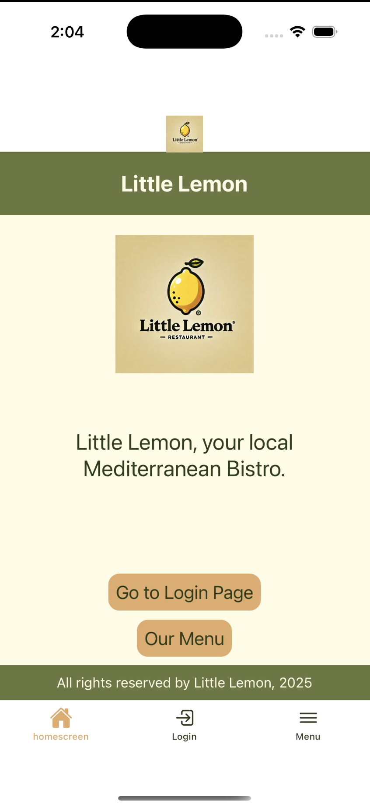
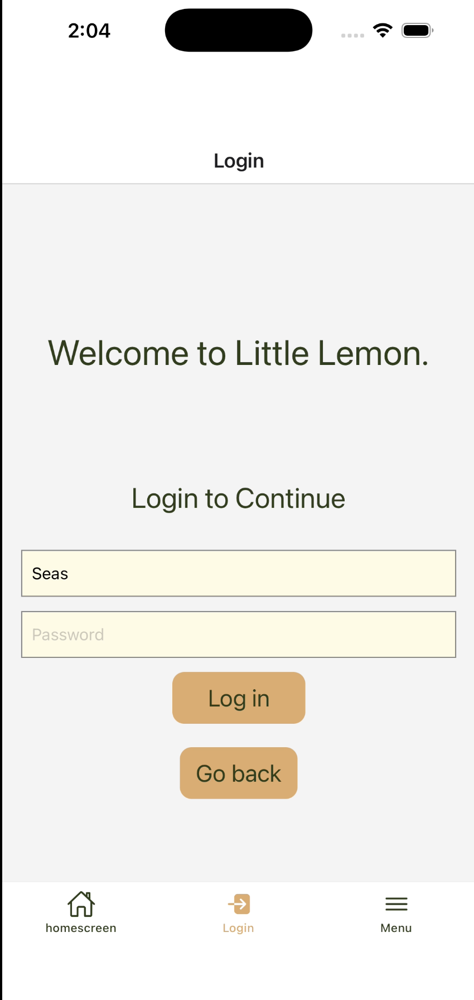

# Restaurant Experience App


A cross-platform restaurant app with React Native and Expo. Supports,
1. Home screen.
2. Menu screen with prices.
3. Login screen.
4. Newsletter screen.

## React Native components used
1. View
2. Text
3. KeyboardAvoidingView
4. ScrollView
5. Image
6. Pressable
7. TextInput
8. FlatList
9. SectionList
10. ImageBackground

## React hooks used
1. useState
2. useColorScheme

## Screen navigation types used
1. Stack navigation
2. Tab navigation
3. Drawer navigation

## Prerequisites
1. Node JS.
2. iOS simulator.
3. Expo CLI.
4. Watchman (optional).

## Get started
1. Install dependencies.
   ```bash
   npm install
   ```
2. Start the app.
   ```bash
    npx expo start
   ```
3. Press 'i' to start the app in iOS simulator.
